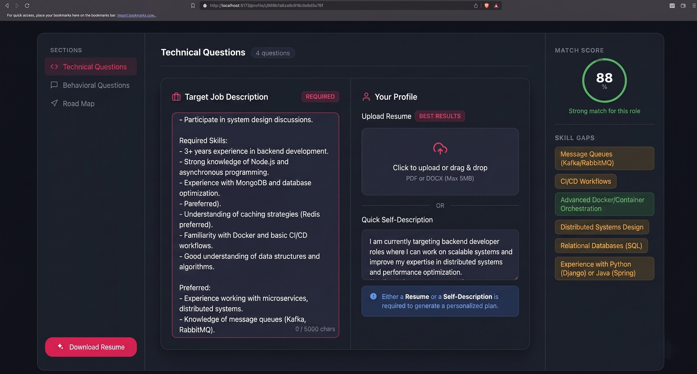
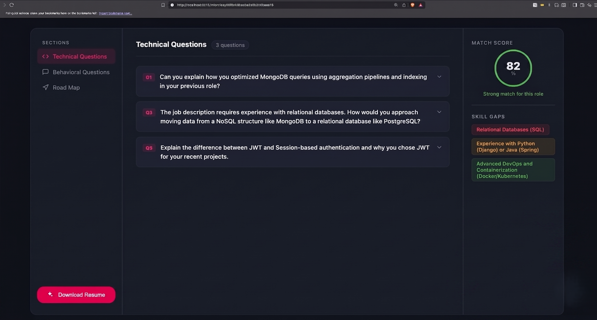

<h1 align="center">🚀 AI Resume Web</h1>

<p align="center">
  AI-Powered Full Stack Resume Builder & Interview Preparation Platform
</p>

<p align="center">
  Built with React.js, Node.js, Express.js, MongoDB & Gemini AI
</p>

---

## 📌 About The Project

AI Resume Web is a modern full-stack web application designed to help users build professional ATS-optimized resumes using AI. The platform analyzes resumes, extracts skills, detects missing industry-relevant skills, and generates high-quality PDF resumes for real-world job applications.

This project also demonstrates secure authentication, scalable backend architecture, AI integration, and professional MERN stack development practices.

---

# ✨ Features

✅ Secure Authentication using JWT  
✅ Token Blacklisting Implementation  
✅ Gemini AI Integration  
✅ Resume Parsing & Skill Extraction  
✅ AI-Based Skill Gap Detection  
✅ ATS-Optimized Resume Generation  
✅ Dynamic PDF Generation using Puppeteer  
✅ Real-World MERN Stack Architecture  
✅ Responsive Modern UI  

---

# 📸 Screenshots & UI Flow

### 🔐 User Authentication
<p align="center">
  
</p>

### 🎯 Custom Interview & Strategy Plan Generation
<p align="center">
  
</p>

### 📝 AI-Generated Technical Interview Questions & Skill Gaps
<p align="center">
  
</p>

---

# 🏛️ Full Stack Architecture

The application follows a scalable MERN architecture with proper separation between frontend, backend, authentication, AI services, and PDF generation modules.

### 🔹 Frontend
- React.js
- Responsive UI
- Component-Based Architecture
- API Integration

### 🔹 Backend
- Node.js
- Express.js
- REST APIs
- Middleware & Validation

### 🔹 Authentication
- JWT Authentication
- Protected Routes
- Token Blacklisting

### 🔹 AI Features
- Gemini API Integration
- Resume Analysis
- Skill Extraction
- Skill Gap Detection

### 🔹 PDF Engine
- Puppeteer PDF Generation
- ATS-Friendly Resume Formatting

---

# 🛠️ Tech Stack

| Technology | Usage |
|------------|-------|
| React.js | Frontend |
| Node.js | Backend Runtime |
| Express.js | Backend Framework |
| MongoDB | Database |
| JWT | Authentication |
| Gemini API | AI Features |
| Puppeteer | PDF Generation |

---

# 📂 Project Structure

```bash
AI-Resume-Web/
│
├── Frontend/
│   ├── public/
│   ├── src/
│   │   ├── assets/
│   │   ├── components/
│   │   ├── pages/
│   │   ├── context/
│   │   ├── services/
│   │   ├── App.jsx
│   │   └── main.jsx
│   │
│   ├── package.json
│   └── vite.config.js
│
├── Backend/
│   ├── controllers/
│   ├── middleware/
│   ├── models/
│   ├── routes/
│   ├── utils/
│   ├── config/
│   ├── server.js
│   ├── package.json
│   └── .env
│
├── README.md
└── .gitignore
